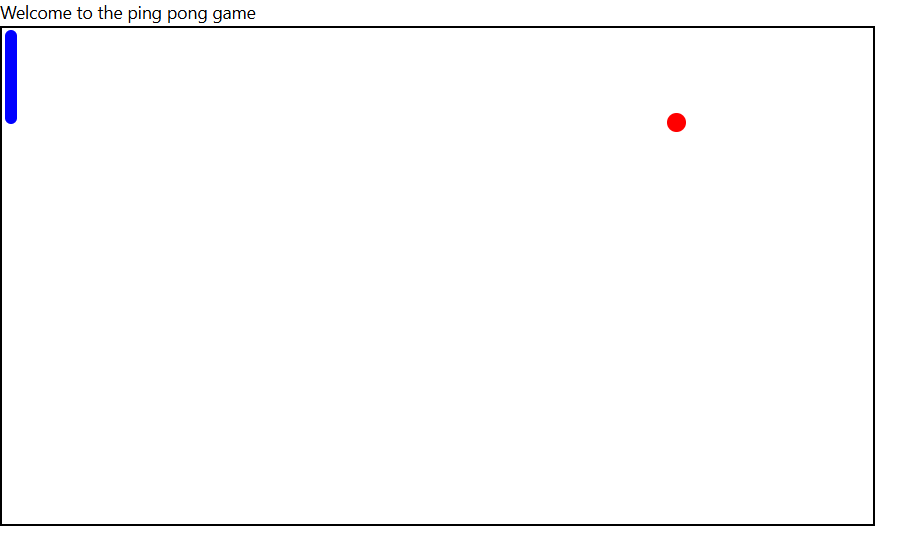

# 🏓 Ping Pong Game

Welcome to the **Ping Pong Game**! This simple yet fun game uses HTML, CSS, and JavaScript to simulate a basic ping pong environment, allowing users to control a paddle and hit a bouncing ball. This is a great project for learning about animations, DOM manipulation, and event handling in JavaScript!

---

## 🚀 Demo

_Screenshot of the game in action!_


---

## 📂 Project Structure

```plaintext
Pingpong/
├── index.html    # HTML structure
├── index.js      # JavaScript functionality
├── style.css     # Styling for game components
└── README.md     # Project documentation
```

---

## 🛠️ Technologies Used

- **HTML5**: Structure of the game interface
- **CSS3**: Styling and layout of game elements
- **JavaScript**: Game logic and animations

---

## 📜 Features

- **Paddle Control**: Move the paddle using the arrow keys or by mouse movements.
- **Ball Animation**: The ball bounces off walls and the paddle, changing direction upon collision.
- **Collision Detection**: Detects collisions with the paddle and walls for an interactive experience.

---

## 🧩 Code Overview

### HTML Structure (`index.html`)

```html
<!DOCTYPE html>
<html lang="en">
  <head>
    <meta charset="UTF-8" />
    <meta name="viewport" content="width=device-width, initial-scale=1.0" />
    <link rel="stylesheet" href="style.css" />
    <title>Ping Pong Game</title>
  </head>
  <body>
    <div>Welcome to the ping pong game</div>
    <div id="ping-pong-table">
      <div id="paddle"></div>
      <div id="ball"></div>
    </div>
    <script src="index.js"></script>
  </body>
</html>
```

### JavaScript Logic (`index.js`)

Handles the ball's movement, paddle control, and collision detection.

```javascript
document.addEventListener("DOMContentLoaded", () => {
  const paddle = document.getElementById("paddle");
  const ball = document.getElementById("ball");

  let ballX = 50,
    ballY = 50;
  let dX = 2,
    dY = 2;

  setInterval(function exec() {
    ballX += dX;
    ballY += dY;

    ball.style.left = `${ballX}px`;
    ball.style.top = `${ballY}px`;

    if (ballX > table.offsetWidth - ball.offsetWidth || ballX <= 0) dX *= -1;
    if (ballY > table.offsetHeight - ball.offsetHeight || ballY <= 0) dY *= -1;
  }, 1);
});
```

### Styling (`style.css`)

Gives a minimalistic design to the ping pong table, paddle, and ball.

```css
#ping-pong-table {
  border: 2px solid black;
  width: 700px;
  height: 400px;
  position: relative;
}

#paddle {
  background-color: blue;
  width: 10px;
  height: 75px;
  position: absolute;
}

#ball {
  background-color: red;
  width: 15px;
  height: 15px;
  border-radius: 50%;
  position: absolute;
}
```

---

## 🕹️ How to Play

1. Clone the repository:
   ```bash
   git clone https://github.com/your-username/Pingpong.git
   ```
2. Open `index.html` in your browser to start playing.
3. Use the **up and down arrow keys** or **mouse** to control the paddle.

---

## 🖥️ Preview

### Paddle Controls

- **Arrow Keys**: Move the paddle up and down
- **Mouse**: Hover the mouse over the table to control the paddle position

---

## 🤝 Contributions

Feel free to contribute by creating a pull request or opening an issue if you encounter bugs or have feature suggestions!

---

## 📜 License

This project is licensed under the MIT License.

---

Enjoy playing the game and happy coding! 🎉
